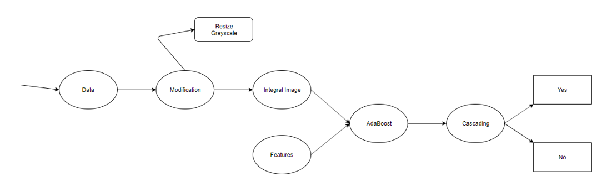

# Face Detection
Face Detection - Viola Jones ML
NOTE: I went to depression with the project. 

The project deals with the implementation of one of the most popular face detection algorithms, Viola Jones. Viola Jones is a machine learning algorithm based on extraction of facial features for face detection. The whole algorithm was implemented from scratch so there’s a lot of room for improvement. After the algorithm was implemented, the training was done with 10,000 images. Multiple training was done in attempt to increase the accuracy and proficiency of the detection algorithm. At this point the algorithm gives an accuracy of 80% and leaves a lot of room for improvement.

The data set used for training was from CMU (Carnegie Mellon University). The dataset contained over 200,000 face images among which only 3000 frontal face pictures were selected. The negative images were also from CMU website. 5000 negative images were selected. The higher number of negative images were selected so we could minimize false positive rates. There was a total of 2000 images for testing purposes; 1000 positive, 1000 negative. This gave us a near to perfect 20% on testing and 80% on training set. No verification data was used to minimize the process. Each of the face images were pre-processed to rescale them to 30x30 size images. Also, grayscale version was used for training and testing. 

The overall Viola Jones algorithm was implemented using python version 3.7. The algorithm itself had four parts to it: Integral Image, Features, AdaBoost, and Cascading. The first was pre-processing of the images. The images were converted to integral image which helped to minimize computation time. A set of features for 30x30 images were predetermined and applied onto the integral images. The features helped determine small facial characters and combination of such features helped to determine if a face was present. These features, also known as weak classifiers, were given weights based on the number of training data. The whole training while adjusting the weights of the weak classifiers was done using AdaBoost algorithm. This algorithm returned the best specified number of classifiers. The combination of these weak classifiers gave a strong classifier and when these strong classifiers were combined on level format, gave us a low false positive rate. This combining of strong classifiers into a level order was Cascading.

The libraries used were:
1.	opencv (images)
2.	numphy (math)
3.	sklearn (selection of best features)
4.	pickle (saving the algorithm)
5.	os (loading images)

The Viola Jones algorithm was used because of following reasons:
Super Most - I wanted to use it for my later project (Face Detection)
1.	Most popular feature extraction face detection algorithm
2.	Better understanding of overall algorithm
3.	Learn how to use adaboost algorithm
4.	Fast if trained properly
5.	Easily available resources for references
6.	Enhance python programming skills

# Solution Design

Although the algorithm gave me an accuracy of 80%, the whole algorithm could be refined and improvised. First, the algorithm can only detect face of specific sizes. The main reason behind this is lack of scaling of features while training. While this could be of huge significance, the whole training process could have taken lot longer with limited resources. Additionally, the algorithm can’t detect multiple faces in the save image for now. The reason roots back to the lack of scaling of features.
While the algorithm has drawbacks, this opens a lot of door for contribution. From selection of new and proper dataset and scaling the features while training to improvement to cascading algorithm, everything can be improved. 

References:

•	http://www.vision.caltech.edu/html-files/EE148-2005-Spring/pprs/viola04ijcv.pdf 
•	https://towardsdatascience.com/boosting-algorithm-adaboost-b6737a9ee60c 
•	https://medium.com/datadriveninvestor/understanding-and-implementing-the-viola-jones-image-classification-algorithm-85621f7fe20b 
•	https://www.researchgate.net/publication/325933489_An_Efficient_Training_Procedure_for_Viola-Jones_Face_Detector 
•	https://www.vocal.com/video/face-detection-using-viola-jones-algorithm/ 
•	https://www.pyimagesearch.com/2017/08/21/deep-learning-with-opencv/ 

